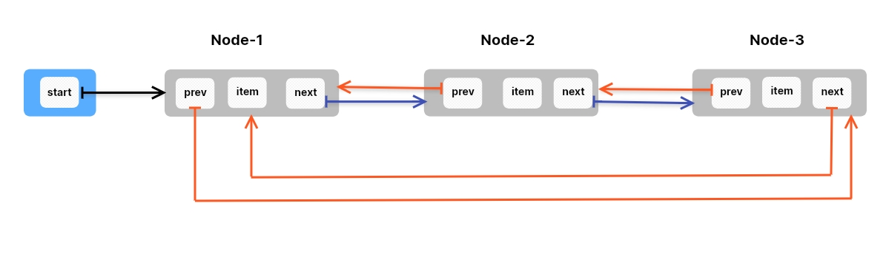

# Circular Doubly Linked List (CDLL): -
- A Circular Doubly Linked List is a variant of Doubly Linked List Data Structure where the Last Node points to the 
  First Node, forming a circular structure.**Each Node contains _data_, a pointer to the _next Node_ and a pointer to 
  the _previous Node_.**
- It allows us to traversal both directions forward and backward.

- **Picture Representation of CDLL: -**

---------------

### Basic Practice Problems On CDLL: -

1. Define a class `Node` to describe a node of a Circular Doubly Linked List.
2. Define a class CDLL to implement Circular Doubly Linked List with `__init__()` method to create and initialize last
   reference variable.
3. In class, CDLL define a method `is_empty()` to check if the linked list is empty in CDLL class.
4. In class, CDLL define a method `insert_at_start()` to insert an element at the starting of the list.
5. In class CDLL define a method `insert_at_last()`  to insert an element at the end of the list.
6. In class CDLL, define a method `search()` to find the node with specified element value.
7. In class CDLL, define a method `insert_after()` to insert a new node after a given node of the list.
8. In class CDLL define a method `printList()` to print all the elements of the list.
9. In class CDLL, define a method `delete_first()` to delete a first element from the list.
10. In class CDLL, define a method `delete_last()` to delete last element from the list.
11. In class CDLL, define a method `delete_item()` to delete a specified element from the list.
12. In class CDLL, implement `iterator` for CDLL to access all the elements of the list in a sequence.