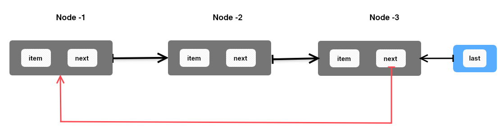

# CLL (Circular Linked List): -

- Circular Linked List is a Linear Data Structure.
- Circular Linked List **Performance** is better than **SLL**, so we can use CLL place of SLL.
- **Picture Representation Of CLL:** -

-------

## Elementary Operations:-

1. Insertion
2. Deletion
3. Traversing
4. Searching
5. Checking For Empty List

### 🌟 Important Points :-
- **If `CLL` contains only one item then that Node contains reference of self.**
- **Circular Linked List Performance is better than SLL so we can use CLL place of SLL.**
-------

## Basic Practice Problems On CLL: -

1. Define a `class Node` to describe a Node of Circular Linked List (CLL).
2. Define a class to implement Circular Linked List with `__init__()` method to create and initialize last reference
   variable.
3. Define a method `is_empty()` to check if the linked list empty in CLL class.
4. In CLL class define a method `insert_at_start()` to insert an element at the starting of the list.
5. In class CLL define a method `insert_at_last()` at the end of the list.
6. In class, CLL define a method `search()` to find a Node with a specified element value.
7. In class CLL define a method `insert_after()` to insert a new node after a given node of the list.
8. In class CLL define a method `printList()` to print all elements of the list.
9. In class CLL define a method `delete_first()` to delete a first element from the list.
10. In class CLL define a method `delete_last()` to delete last element from the list.
11. In class CLL define a method `delete_item()` to delete a specified element from the list.
12. In a class CLL implement `iterator` for CLL to access all the elements of the list in a sequence.

