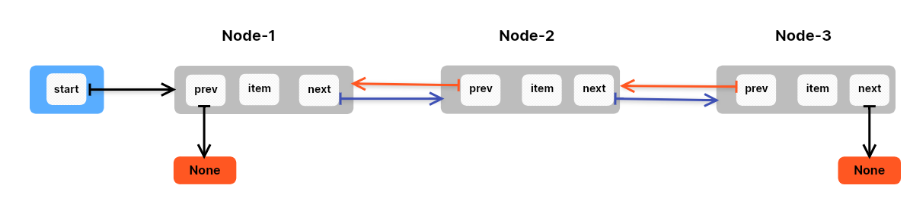

## DOUBLY LINKED LIST:-

* **DOUBLY LINKED** LIST is a linear data structure.
* It can grow and shrink.
* Picture Representation Of DLL

------------
### <ins>Basic Operation on DLL :- </ins>
1. Insertion
2. Deletion
3. is_empty
4. traversing
----------------
### Basic Practice Problems on DLL: -
1. Define a class Node to describe a node of `Doubly Linked List`.
2. Define a class DLL to implement Doubly Linked List with `__init__()` method to create and initialize `start` 
   reference variable.
3. Define a method `is_empty()` method to check if the Linked list is empty in DLL class.
4. In class DLL define a method `insert_at_start()` to insert an element at the starting of the list.
5.  In class DLL define a method `insert_at_last()` to insert an element at the end of the list.
6. In class DLL define a method `search()` to find the node with specified element value.
7. In class DLL define a method to `printList()` to print all elements of the list.
8. In class DLL define a method  `insert_after()` to insert data in a sequence. 
9. In class DLL define a method `delete_first()` to delete a first element. 
10. In class DLL define a method `delete_last()` to delete last element.
11. In class, DLL defines a method `delete_item()` to delete a specified element from the list.
12. In class, DLL implements `iterator` to DLL to access all the elements of the list in a sequence.

------
- **Some Important Points are That we have to be careful when we operate `Insert Operations`: -**

1. When we insert the first Node in DLL (DLL is empty).
2. When we insert second Node in DLL.
-----
- **Some Important Points are That we have to be careful when we operate `Delete Operations`: -**

1. DLL is not empty.
2. If DLL contains only One Node.
3. If DLL contains at least Two Nodes.
