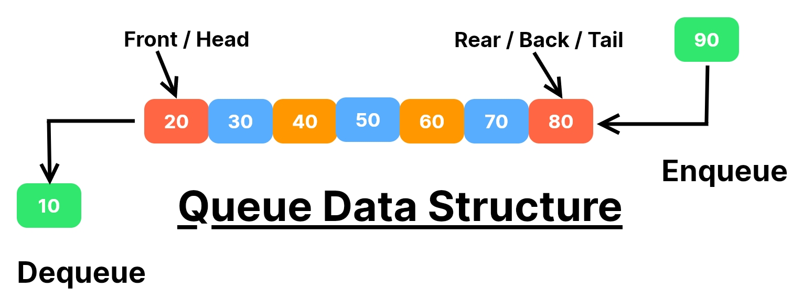

# 
Queue :-

## What is Queue: - 

- Queue is a `Linear Data Structure` working principle of Queue is `First In First Out (FIFO)` or `Last In Last Out 
(LILO)`.
- It Operates like a line where elements are `added` at one end `(rear)` and `remove` from the other end `(front)`.

- **Picture Representation Of Queue :-**

----------

## Operation Of Queue: -
1. **enqueue (insertion)** :- Adds an element to the rear of the Queue.
2. **dequeue (deletion)** :- Removes and returns the element from the front of the Queue.
3. **is_empty()**:- Checks if the Queue is empty.
4. **get_front()**:-Returns the oldest element of the Queue.
5. **get_rear()**:- Returns the latest element of the Queue.
6. **size()**:-Returns the size of the Queue.
-------
## Real World Examples Of Queue: -
1. Queue for roller coaster ride in an amusement park.
2. **Shuttlecock** (Badminton) in a cylindrical box.

------
## Programming Examples:-
1. Print Tasks in a printer
2. Admission module to implement first come to first server.
3. Breadth-First Search
------

## Implementation Of Queue:-
1. Using List
2. By Extending the List
3. Using Singly Linked List Class.
4. By Extending Singly Linked List class.
5. Using Linked List Concept.

