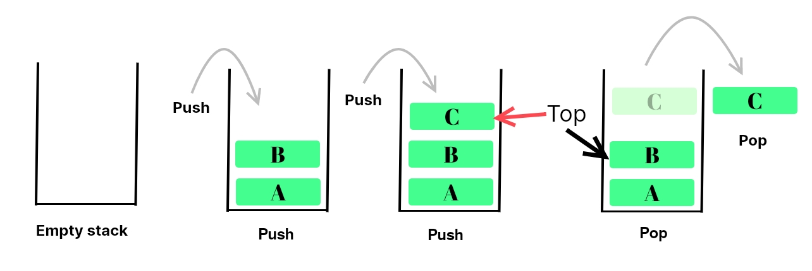
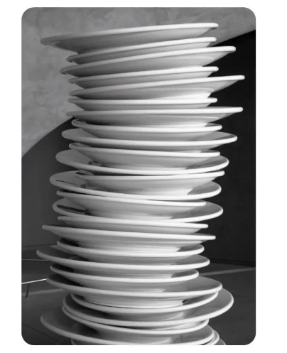

# **Stack Data Structure :-**

- **Stack:** — Stack is a **Linear Data Structure** working principle of stack is `Last in First Out (LIFO)` or `First in
  Last Out (FILO)`.
- In Stack, a new element is added in one end and removes that element from that end only.
- **Picture Representation Of Stack:** 

- **Real World Example Of Stack:** 

#### Operations On Stack: -

1. push
2. pop
3. is_empty
4. peek
5. size

--------

## Programming Examples Of Stack: -

1. _**Function call stack**_
2. _**Evaluating expressions**_
3. _**Parenthesis matching**_
4. _**Iterative Solution of binary tree travesal**_
5. **_Undo - Redo Operations_**
6. _**Depth-First Search**_

------

## Real World Examples Of Stack: -

1. _**Travelling Bag**_
2. _**Bread Packet**_
3. _**Stack Of Books**_
4. _**Complied Plates in Buffet**_

--------

### Implementation Of Stack:-

1. _**Using List**_
2. _**By extending list class**_
3. _**Using Singly Linked List class**_
4. _**By extending Singly Linked List class**_
5. _**Using Linked List concept.**_
